- 初始化单机架构

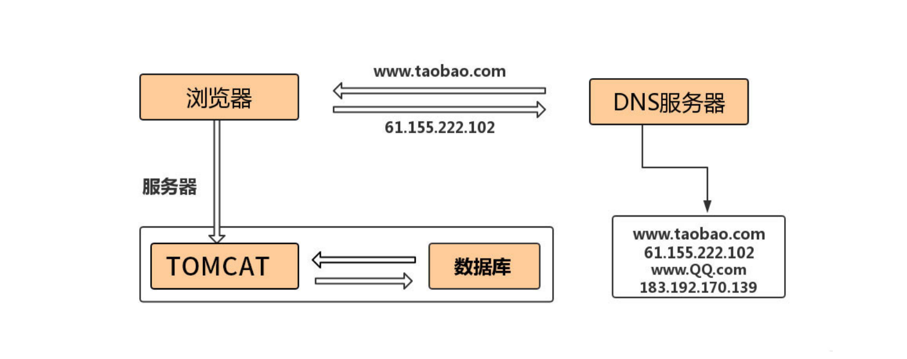

- 第⼀次演进：Tomcat与数据库分开部署

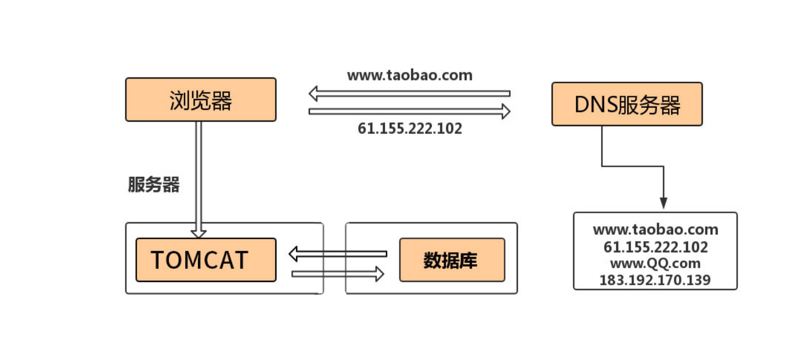

- 第⼆次演进：引⼊本地缓存和分布式缓存

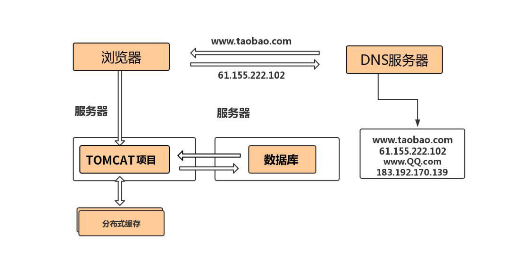

数据库出现卡顿，优化索引，慢查询⽇志，explain select * from table where ab=11

show processlist

kill pid

- 第三次演进：引⼊反向代理实现负载均衡

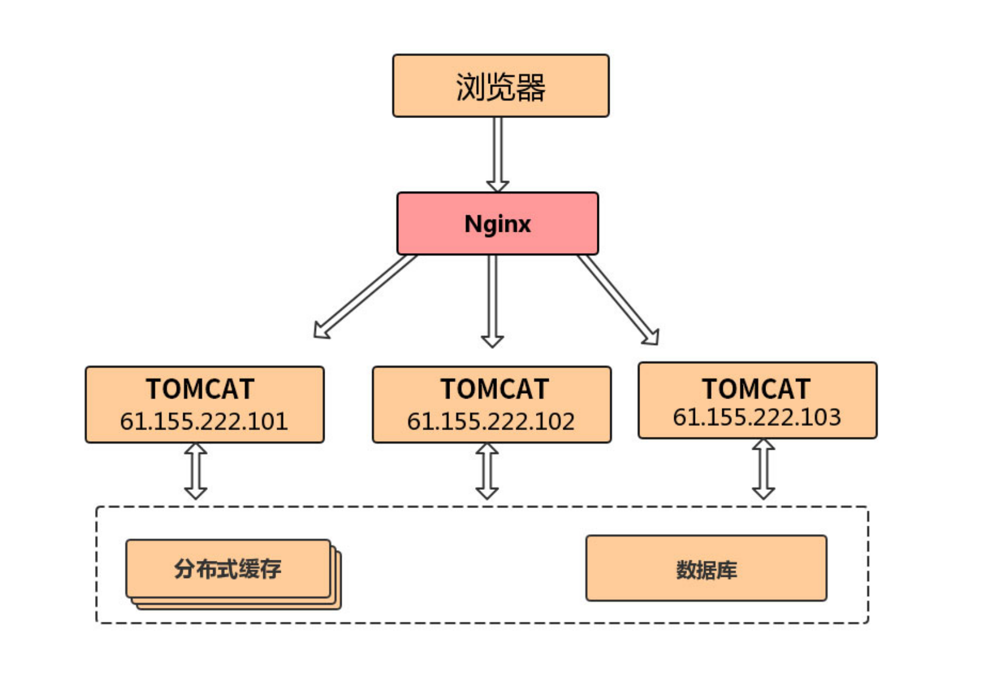

Nginx并发⽀持50000（5w）keepalive 65s，Tomcat的并发建议配置1000-2000，这些并发都有根据

业务进⾏实际的压测

ulimit 1024，socket 128

session共享问题：中⼼化

⽂件上传下载：中⼼化

- 第四次演进：数据库读写分离

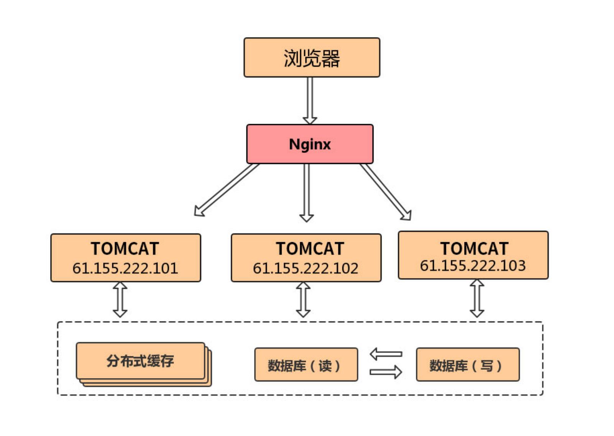

将从库给到缓存进⾏数据收集，并将后台服务给到从库进⾏报表查询

- 第五次演进：数据库按业务分库

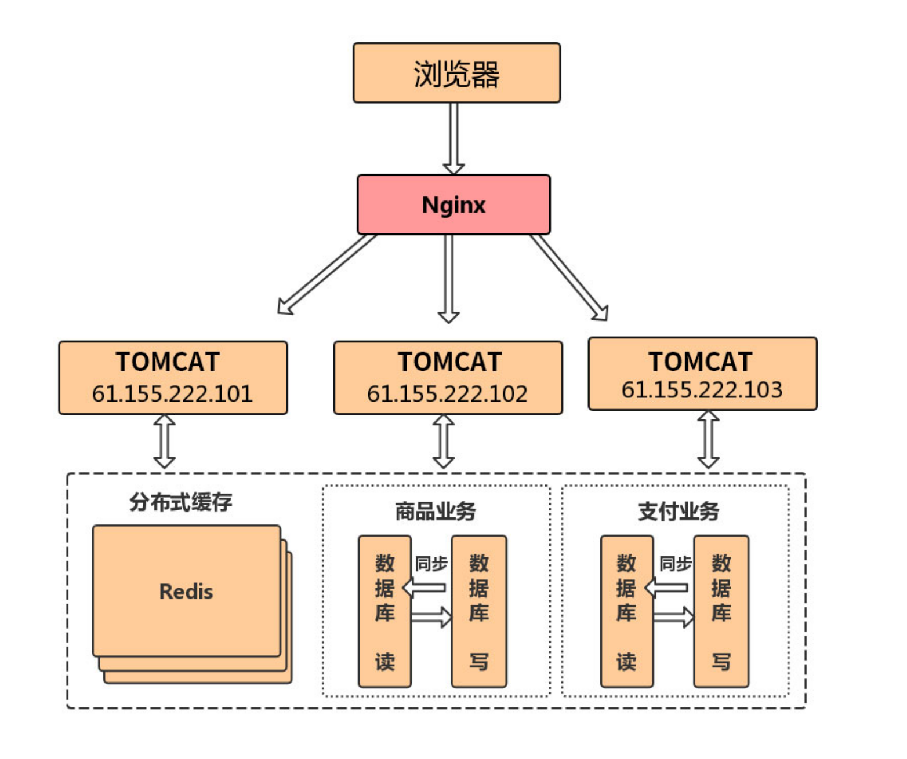

- 第六次演进：把⼤表拆分为⼩表

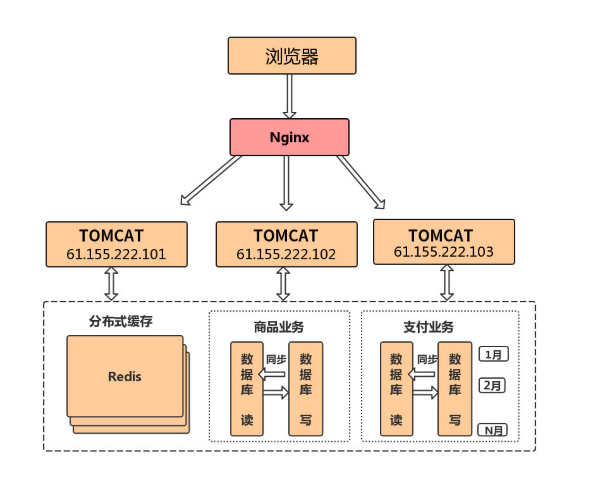

- 第七次演进：使⽤LVS或F5来使多个Nginx负载均衡

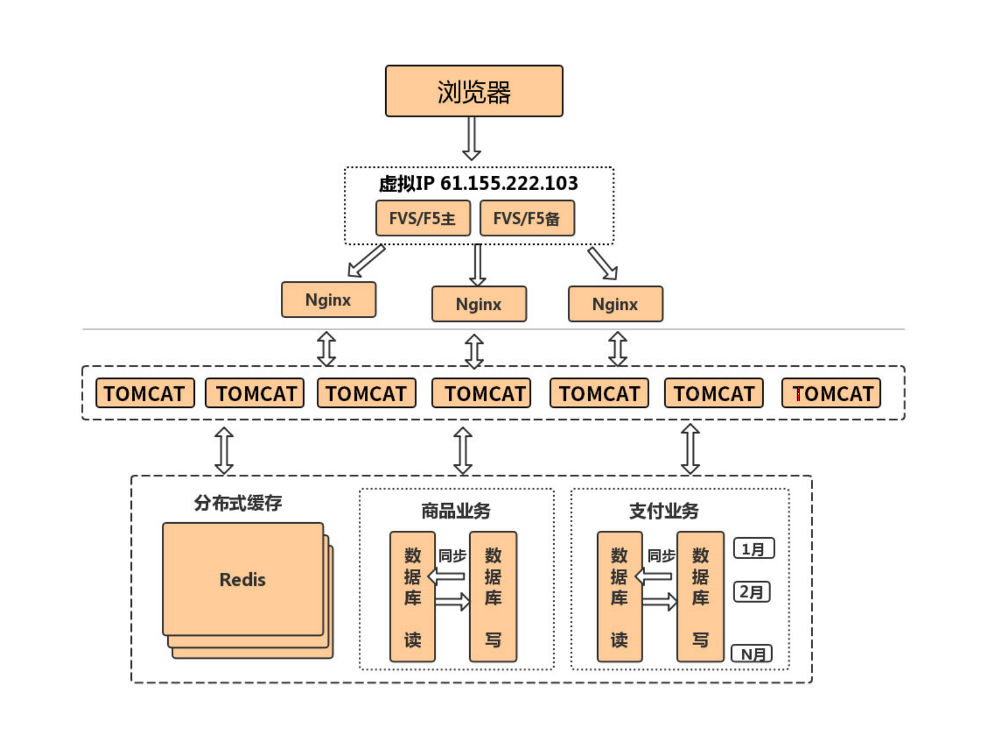

Nginx：7层

Lvs：4层

- 第⼋次演进：通过DNS轮询实现机房间的负载均衡

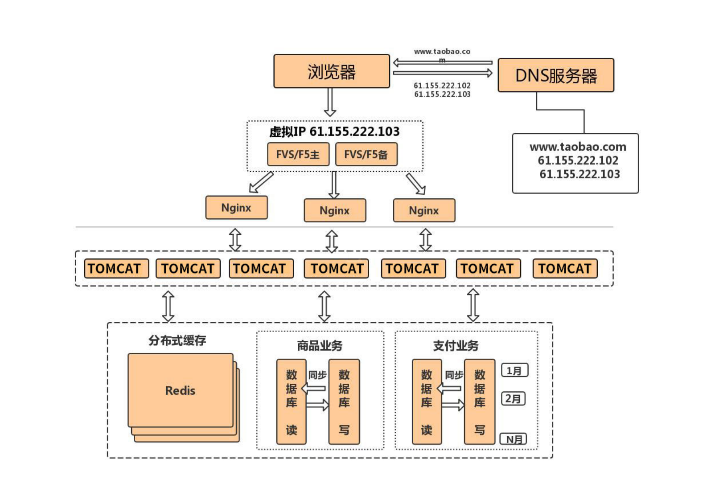

DNS不会帮你做服务的验证，DNS要做多级的缓存加⼊或去掉IP的时间都会很⻓

- 第九次演进：引⼊NoSQL数据库和搜索引擎等技术

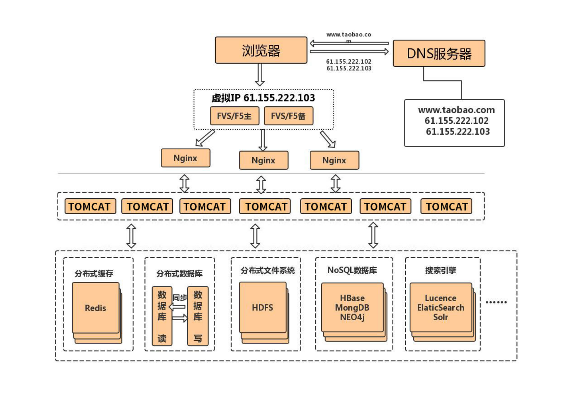

like 'abc%def'，提前放⼊到ES、Solr，Redis会出现雪崩：击穿、服务挂掉

- 第⼗次演进：⼤应⽤拆分为⼩应⽤

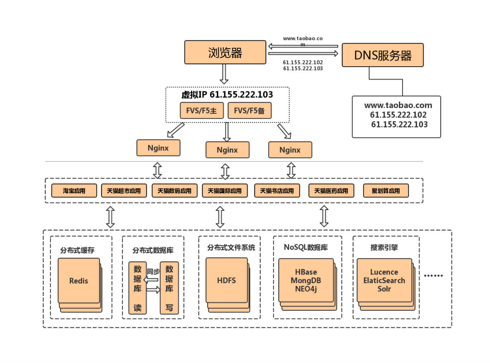

- 第⼗⼀次演进：复⽤的功能抽离成微服务

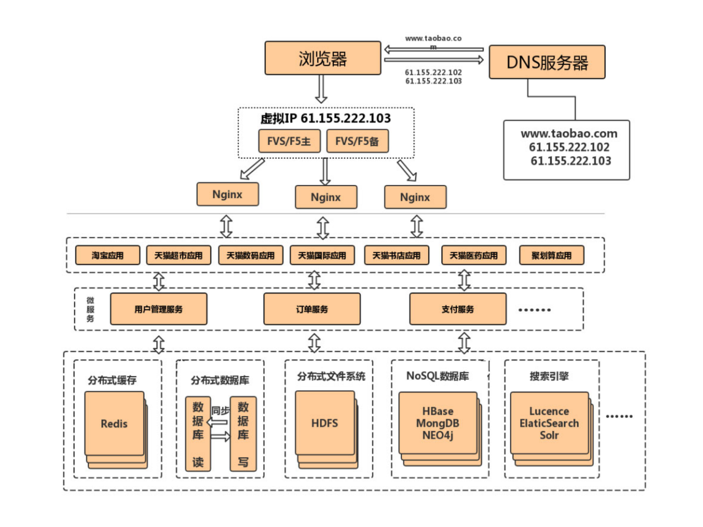

- 第⼗⼆次演进：引⼊企业服务总线ESB屏蔽服务接⼝的访问差异

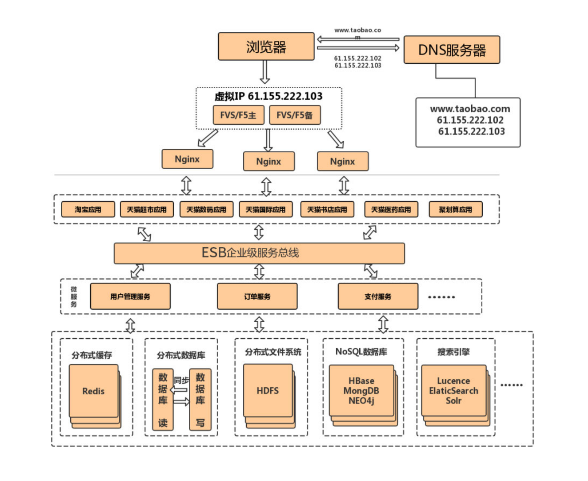

- 第⼗三次演进：引⼊容器化技术实现运⾏环境隔离与动态服务管理

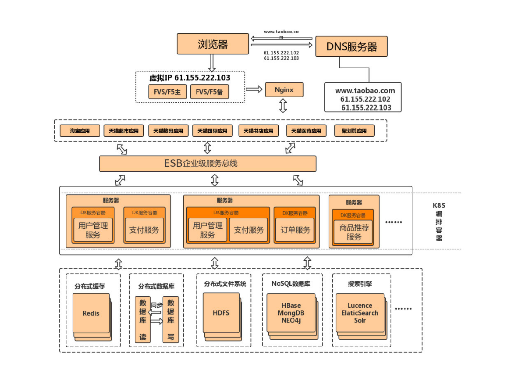

- 第⼗四次演进：以云平台承载系统

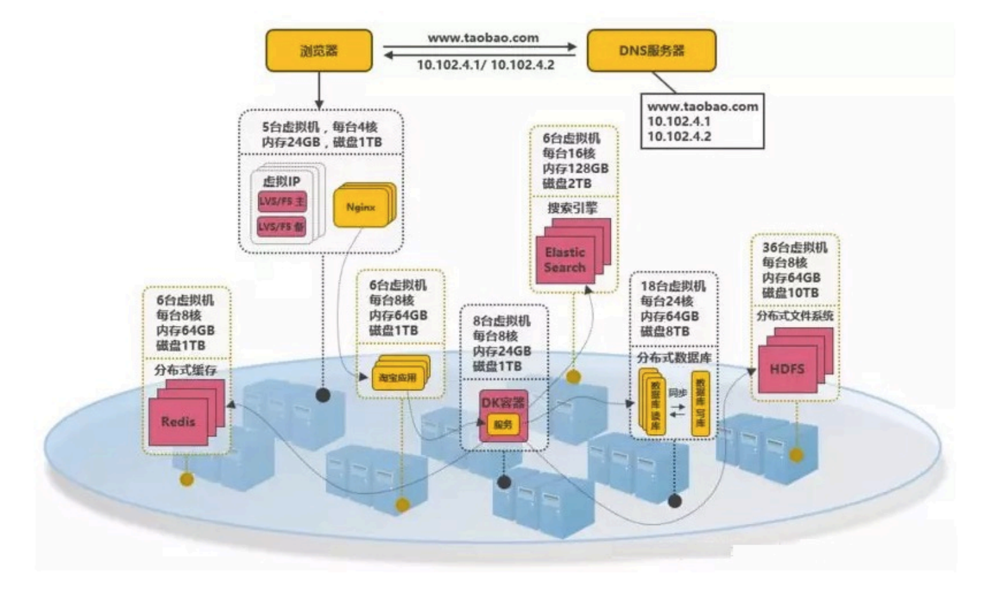